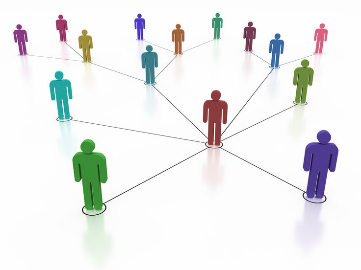
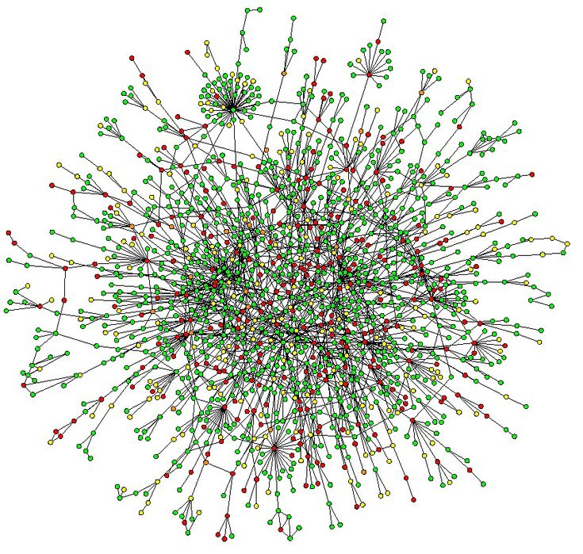
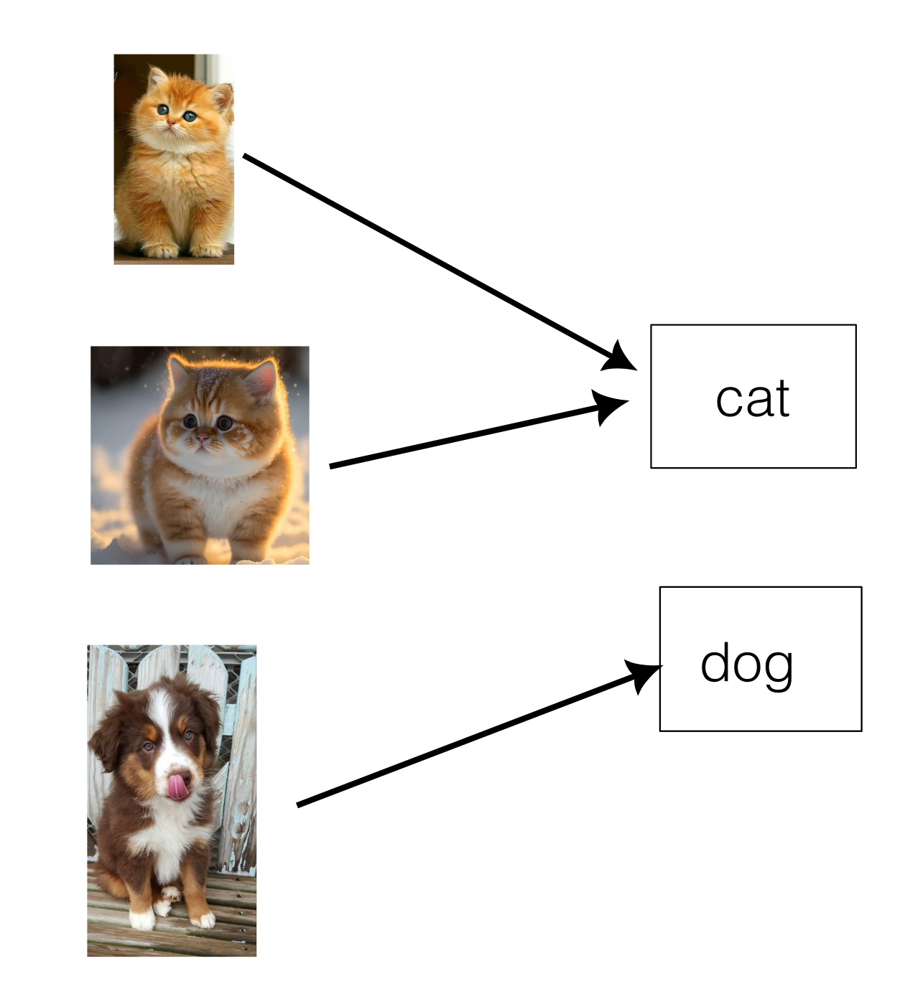
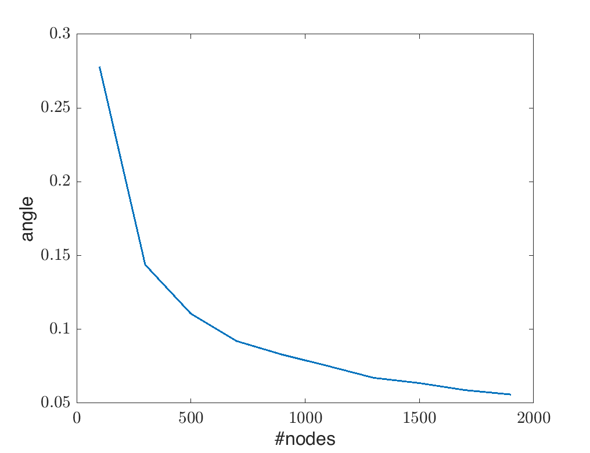
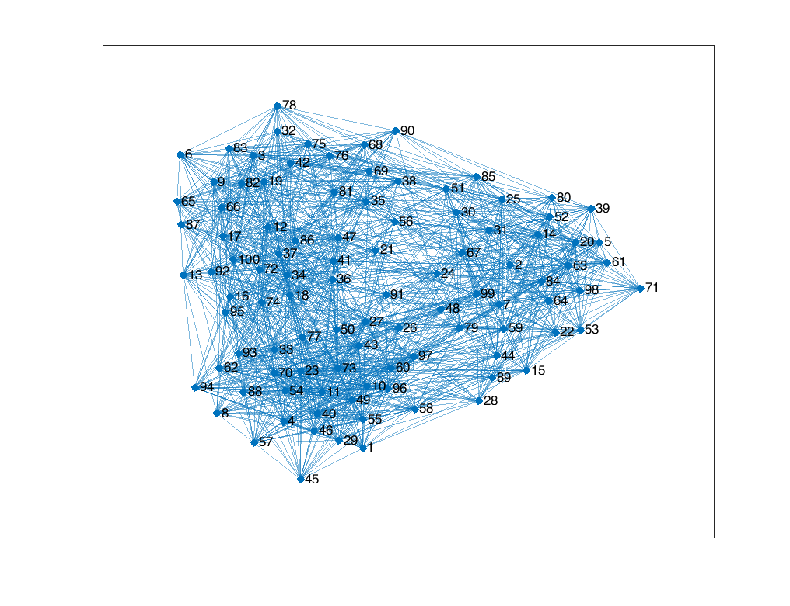
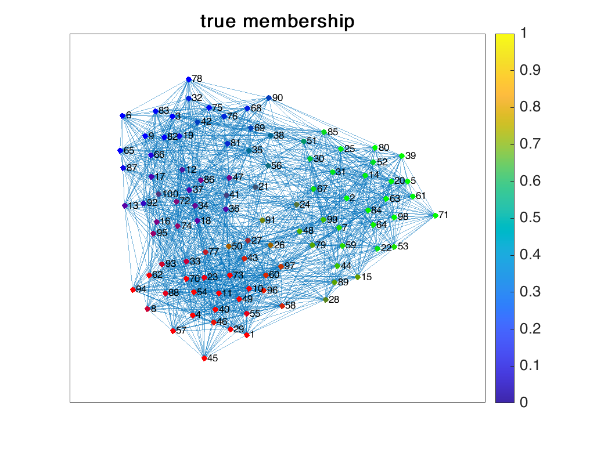
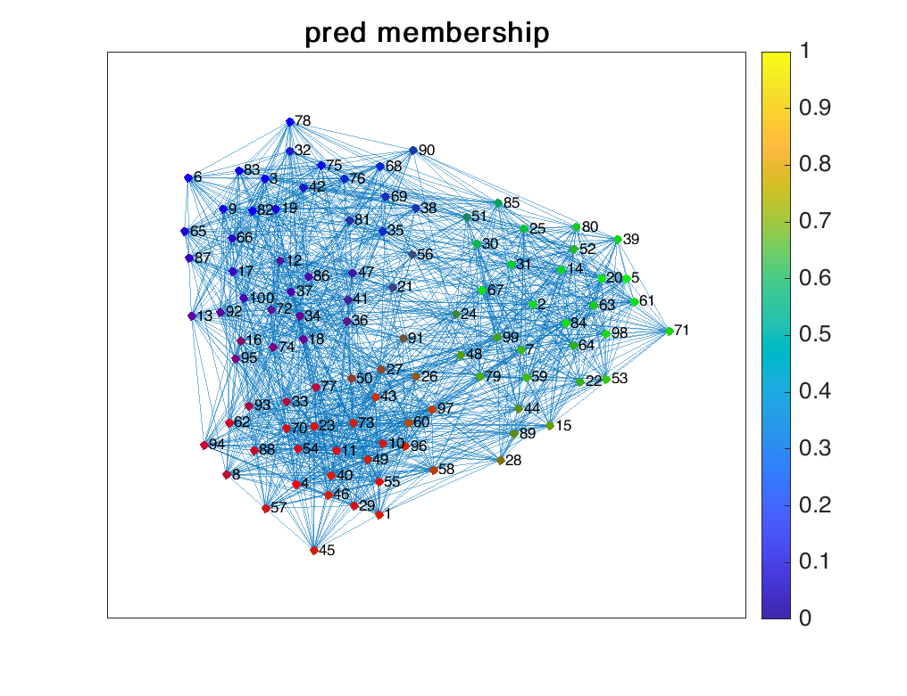

# Community Detection with Matrix Decomposition

Network data is presented everywhere nowadays, such as network of friends on social media, network of bees, networks of proteins. While these networks are very large and complex, their underlying structure could be seen as a set of a small groups call communities. Discovering these communities from a complex networks brings out essential characteristics of the networks, which is an important task for data analysis and exploration.
Community detection problems aims at finding out membership of all nodes in a given network.
<!-- We wish to understand the underlying structure of these networks.  -->
<!-- There are many several views regarding membership of a node, depending on particular dataset or application. -->
<!-- A node can belong to at most 1 community, or a node can simultaneously belong to several communities, each with different weighting association. -->

In this article, we cover how this problem is modeled using matrices, and dealt with using matrix factorization techniques.

## Model and Problem Statement
<!-- Let us go through several models, gradually make them more complex. -->
We assume that there are $K$ distinct communities. Each node has a membership vector that indicates its membership with respect to these communities. 
This can be represented using a nonnegative vector $\bm{m} \in \mathbb{R}^{K}$ where $0\leq m_i \leq 1$, and $\sum_{i} m_i = 1$. 

A simple scenario is that a node can only belong to a single group. This happens for example in classification problem, where each item has a single class label.

But different from classification problem, we only observe the interaction among nodes. Particularly, an edge from $i$ to $j$ is more likely to be observed if node $i$ and $j$ belong to the same community. These edge can be directional, un-directional, unweighted, or weighted, depending on particular model and dataset.

Consider a simple case of un-directional, unweighted edges. 
Then an edge between two nodes $i$ and $j$ is modeled as a Bernoulli random variable, 
$$
a_{ij} \sim \text{Bernoulli}(p_{ij}),
$$ 
where parameter $p_{ij}$ is reflected by
- Membership of the two nodes belong to the same groups.
- The inherent interaction among groups.

One of the well-known model named Mixed-Membership Block Model [1] assumes 
$$
p_{ij} = \bm{m}_i^{\sf T} \bm{B} \bm{m}_j
$$ 
The matrix $\bm{B} \in \mathbb{R}^{K \times K}$, which is assumed to be symmetric models the inter-interaction among groups. 
A diagonal dominant $\bm{B}$ models a network where nodes within a group tends to interact with each other much more often than interacting with a node outside of the group. For instance, memberships within the robotics club tend to have more connections to each other, maybe because they share the same interest, and have more common courses in their study, than the connections to students in the literature club. Although these connections are possible, they are rare.

On the other hand, a off-diagonal dominant matrix $\bm{B}$ models a network where group memberships has little interaction but interacting more to outsiders. This happens naturally to for example bipartite network. For instance, a network of soccer players and their clubs.

A node can belong to a single community, or to simultaneously multiple communities. Elements in the membership vector for each node indicates how strongly the node belongs to certain groups. Specifically, $m_i=1$ and $m_j=0$ for all $j\neq i$ indicates that the nodes only belongs to the $i$-th community. In general, a node can belong to different communities with different level of association.

We are assuming that a network of $N$ nodes and $v$ edges are generated as follows.
Node $i$ has an inherent membership vector $\bm{m}_i \in \mathbb{R}^{K}$, where $m_i \geq 0, \bm{1}^{\sf T}\bm{m} = 1$. Collections of these nodes is presented as matrix $\bm{M} \in \mathbb{R}^{N \times K}$.
An edge between node $i$ and node $j$ is established depending on the interaction between these 2 nodes. Particularly, it is modeled as a Bernoulli distribution:
$$
A_{ij} \sim \text{Bernoulli}(\bm{m}_i^{\sf T} \bm{B} \bm{m}_j).
$$ 

Problem statement: 
Given the binary matrix $\bm{A} \in \mathbb{R}^{N \times N}$ which also represents a un-directional, unweighted network, could we recover the membership of all nodes in that network?

## Some Hints

There are at least two challenges in recovering $\bm{M}$. Firstly, assuming $\bm{P} = \bm{M}^{\sf T} \bm{B} \bm{M}$ is observed, can we estimate $\bm{M}$? 
And secondly, the task is even more challenging since $\bm{P}$ is unobserved. Instead, we only have access to a binary matrix $\bm{A}$ which is a very rough approximation of $\bm{P}$.

Fortunately, a key finding in [panov2017consistent, Lemma 1] reveals that knowing $\bm{A}$ could reveal information about range space of $\bm{M}$. Specifically, denote $\widetilde{\bm{V}} \in \mathbb{R}^{K \times N}$ as $K$ leading eigenvectors of $\bm{A}$, and $\bm{V} \in \mathbb{R}^{K \times N}$as the $K$ leading eigenvectors of $\bm{P}$, then Lemma 1 in [x] implies that
$$
\widetilde{\bm{V}} \approx \bm{V} \bm{O},
$$ 
for some orthogonal matrix $\bm{O}$.
Using simulated data, we can verify this statement empirically. We measure the difference of $\widetilde{\bm{V}}$ and  $\bm{V}$ in terms of angle between 2 subspaces via the command `subspace` in `Matlab` and show the result in the following figure.

As you can see, as number of nodes increases, the angle between $\widetilde{\bm{V}}$ and $\bm{V}$ is smaller.
That implies that with enough number of nodes, we can represent
$$
\widetilde{\bm{V}} = \bm{M} \bm{F} + \bm{N},
$$ 
where $\|\bm{N}\|$ is small.

Then the task boils down to estimating $\bm{M}$ given $\bm{V}$ following the above model. 
In general, this is an NP-hard problem. The issue arises because problem (x) could be multiple solutions.
To see this, considering the ideal case where $\bm{N} = 0$. Then there is no distinction between 2 different solutions $\bm{M}$ and $\bm{M} \bm{Q}$ where $\bm{Q}$ is some non-singular matrix.

<!-- There has been many works dedicated in finding conditions to guarantee that problem [x] has unique solution. -->
The so-called separability condition has been proposed and widely used to guarantee that problem [x] has unique solution. In the context of community detection, it assumes the existence of a 'pure node' for each community. A pure node is a node that only belongs to a single community.

With the assumption of separability on $\bm{M}$, given $\widetilde{\bm{V}}$ we can find $\bm{M}$, as suggested in [x,x,x].

## Algorithms
Given observation $\bm{A}$, we first perform eigendecomposition on the binary $\bm{A}$ to get top $k$ eigenvectors to construct $\widetilde{\bm{V}}$.
Then we can recover $\bm{F}$ using one of the NMF methods such as SPA, FastGradient, Merit [x]. For demonstration, we employed MERIT in this article. 

<!-- And after observing $\bm{A}$, we can estimate $\bm{H}$ by solving a constrained LS problems, i.e., -->
<!-- $$ -->
<!-- \begin{align} -->
<!-- &\min_{\bm{C}} || \bm{U} - \bm{U} \bm{C} ||_{\rm F} \\ -->
<!-- &\text{subject to } \quad \bm{1}^{\sf T} \bm{C} = \bm{1}, \bm{C} \geq 0 -->
<!-- \end{align} -->
<!-- $$  -->
<!-- and solve it using MERIT. -->
<!--  -->
Having $\bm{F}$, we can finally determine the membership matrix $\bm{M}$  by solving a constrained LS problem
$$
\begin{align}
&\min_{\bm{M}} \quad || \widetilde{\bm{V}} - \bm{M}\bm{F} ||_{\rm F} \\
&\text{subject to } \quad \bm{1}^{\sf T} \bm{M} = \bm{1}, \bm{M} \geq 0
\end{align}
$$ 

## Results
We generated a network of $N=100$ nodes, each node's membership respect to $K=3$ communities following a Dirichlet distribution with parameter $0.2 \times \bm{1}_3$. The observation $\bm{A}$ is drawn from the Bernoulli distribution and it defines an un-directional, unweighted network.

