# Attention/Transformer

The goal is to encode an sequential data: $x_1 \to x_2 \to \ldots \to x_t$.

As usual, since $x_i$ is discrete, $x_i \in \mathcal{V}$. Each $v \in \mathcal{V}$ is represented as a trainable vector. In Transformer, this vector is partitioned into 3 disjoint parts: 

- $\textbf{q} \in \mathbb{R}^{d_k}$
- $\textbf{k} \in \mathbb{R}^{d_k}$
- $\textbf{v} \in \mathbb{R}^{d_v}$

This way, a sentence is encoded by 3 matrices $\bm{Q} \in \mathbb{R}^{t \times d_k}, \bm{K} \in \mathbb{R}^{t \times d_k}, \bm{V} \in \mathbb{R}^{t \times d_v}$.

Next idea: the presentation of $x_i$ is a convex combination of other $\bm{x}_j$ where $j=1, \ldots , i-1$.
The presentation is realized by $\bm{v}_i$, so
$$
\text{atten}_i(\bm{v}_i) = \sum_{\ell =1}^{i} a_\ell  \bm{v}_\ell  
= \bm{a}^{\sf T} \bm{V}, \quad \bm{a} \in \mathbb{R}^{t}
$$ 

<!-- - The final presentation should be fixed although the sequence length is varying. -->
<!-- - The encoding mechanism should take into acount the sequential order of the input sample. -->
<!-- - Each $x_i$ should have its own representation, and representation of $x_i$ could be affected by $x_j$, $j<i$ as the context. -->

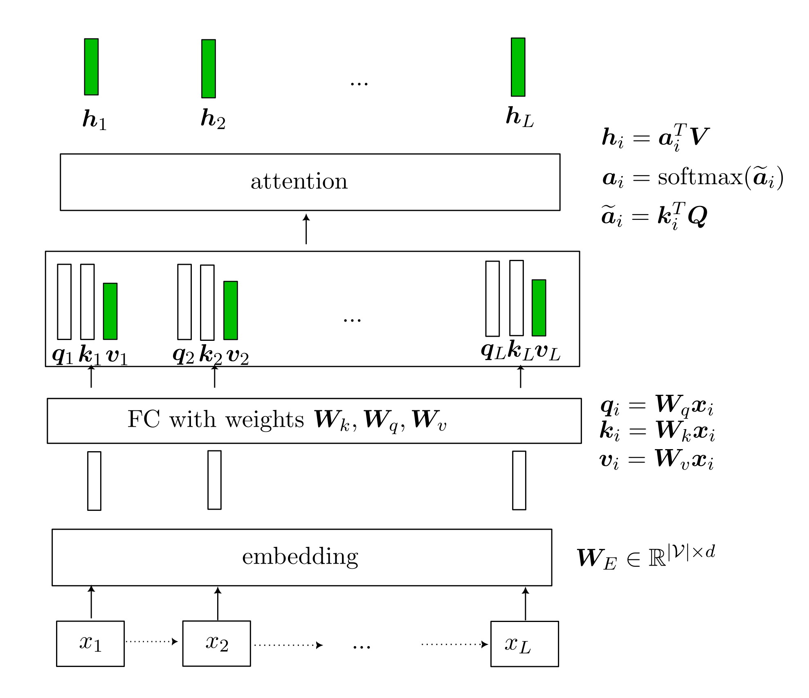
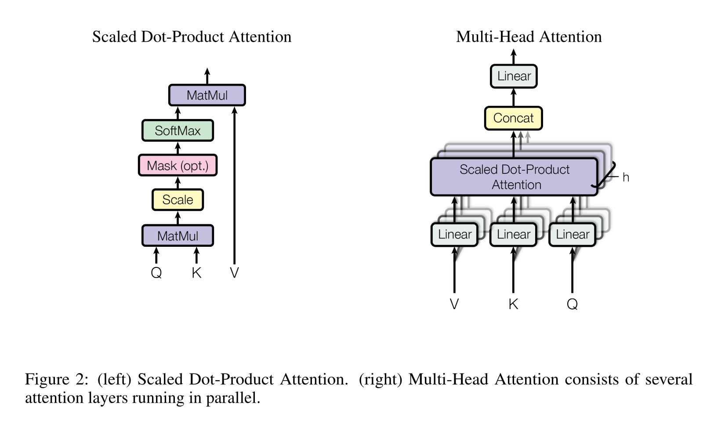

Now the coefficient $a_i$ must be learned somehow. Attention suggests that 
$$
\begin{align*}
&\widetilde{\bm{a}}_i = [\widetilde{a}_1, \ldots , \widetilde{a}_t] = [\bm{q}_i^{\sf T} \bm{k}_1, \ldots , \bm{q}_i^{\sf T} \bm{k}_\ell, \ldots , \bm{q}_i^{\sf T} \bm{k}_t] = \bm{q}_i^{\sf T} \bm{K} \\
&\widetilde{\bm{A}} = [\widetilde{\bm{a}}_1, \ldots , \widetilde{\bm{a}}_t] = [\bm{q}_1^{\sf T} \bm{K}, \ldots , \bm{q}_t^{\sf T} \bm{K}] = \bm{Q}^{\sf T} \bm{K} \\
&\bm{A} = \text{softmax} (\widetilde{\bm{A}}) \triangleq [\text{softmax}(\widetilde{\bm{a}}_i), \ldots , \text{softmax}(\widetilde{\bm{a}}_t)] \in \mathbb{R}^{t \times t}
\end{align*}
$$ 
Each vector $\bm{a}_i$ represent distribution of "attention" of word $i$ paying over the whole sentence.

So take everything as matricies, we have
$$
\begin{align*}
\text{attention} 
&= \bm{A}^{\sf T} \bm{V}, \quad \bm{A} \in \mathbb{R}^{d_v \times t} \\
&= \text{softmax}(\bm{K}^{\sf T} \bm{Q}) \bm{V} \in \mathbb{R}^{t \times d_v}
\end{align*}
$$ 

#### Multiheads 

Then, in order to allow for multiple learned patterns, each word is now presented with $H$ different triples $(\bm{Q}_h, \bm{K}_h, \bm{V}_h)$.
$$
\text{attention} (\bm{Q}\bm{W}_h^{(1)}, \bm{K}\bm{W}_h^{(2)}, \bm{V}\bm{W}_h^{(3)}), \quad h=1, \ldots , H
$$ 
Then as usuall, every thing is concatenated and input to a final FC layer.

Motivation:

#### Order Encoding 

Now as the representation is just a convex combination of some set, there is no notion of order. Hence it is necessary that the order info is encoded in the $\bm{v}$ vector.

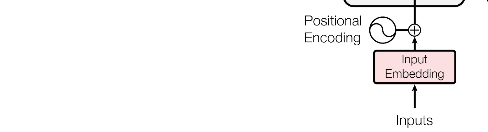

So that's basically it.

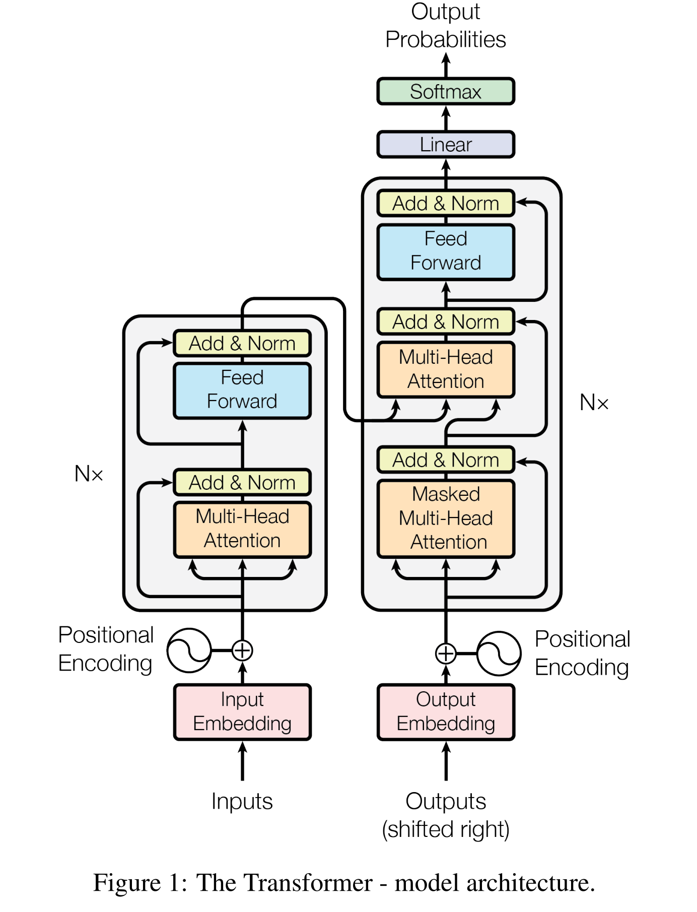

# Flamingo: a visual language model for few-shot learning
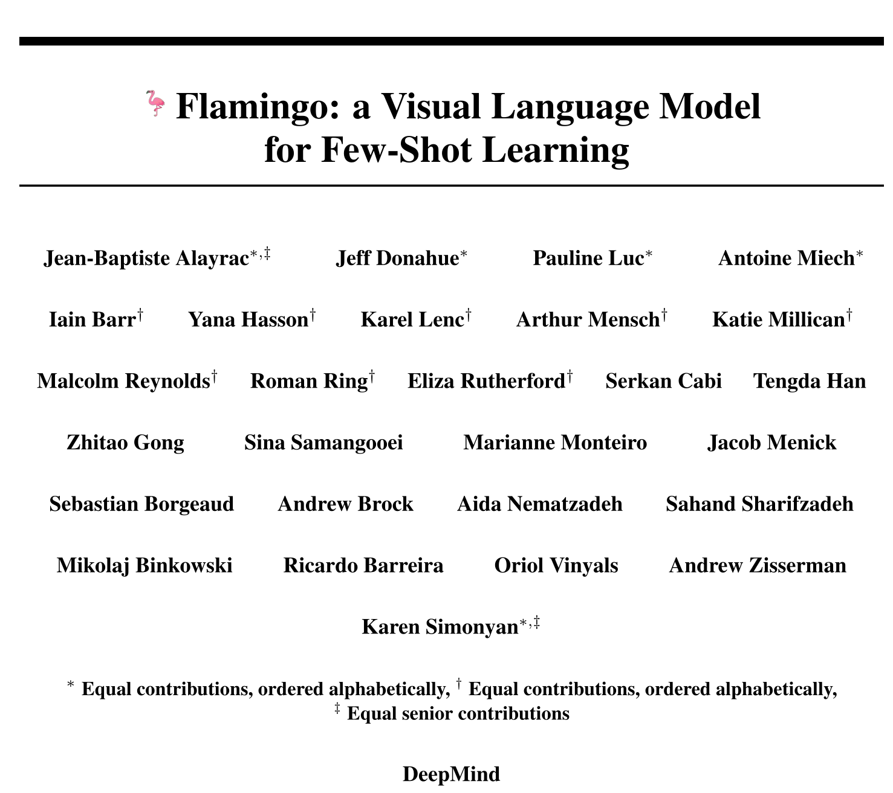

__Task__: 

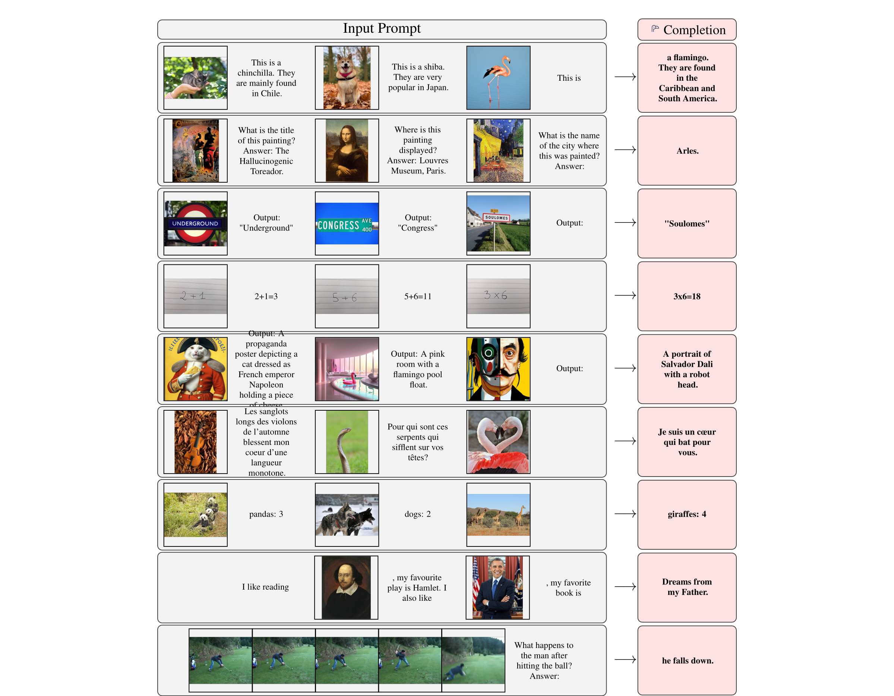

Mixing text and image, predict next word token, pretrained LLM, vision input is undergone a pretrain feature extractor, then to a trainable network to produce a fixed length vector for each image/video input.

Dataset is crawl from webpage, image is replaced by special token  <imgx>

The vision module produce a fixed number of tokens. These tokens are treated as word tokens.

### Method

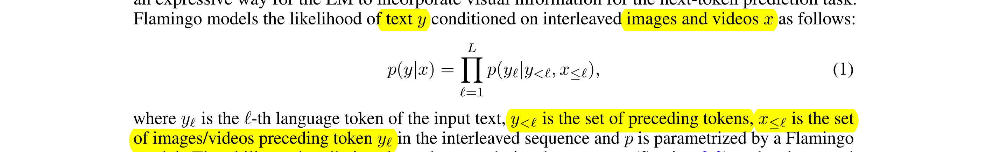

Input example:

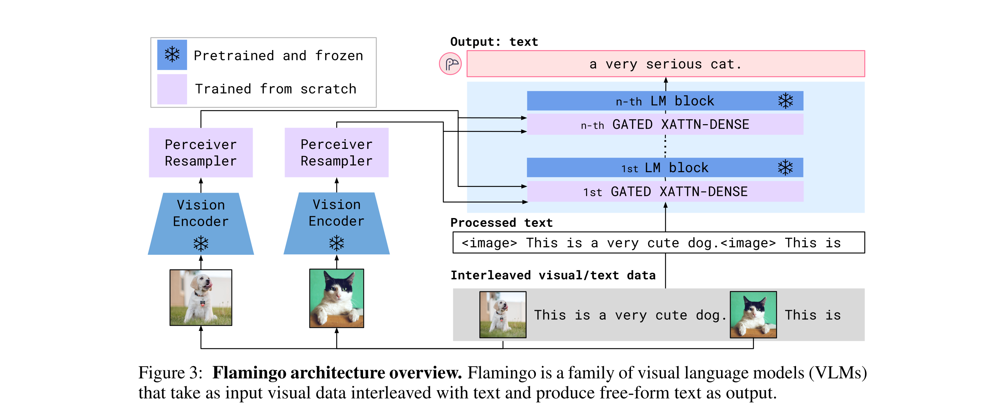

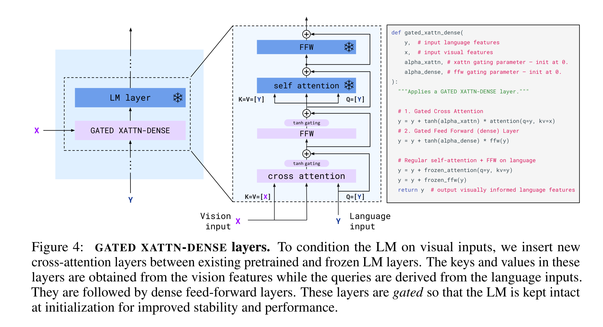

### In more details ...

Data collection:

- 43 million webpages. Sample a random subsequence of 𝐿 = 256 tokens and take up to the first 𝑁 = 5 images included in the sampled sequence
- For image text pairs, 
    + ALIGN [50] dataset contains 1.8 billion images paired with alt-text 
    + LTIP dataset consists of 312 million image and text pairs
    + VTP dataset contains 27 million short videos (approximately 22 seconds on average) paired with sentence descriptions

- beam search for decoding
### Evaluation

- What can it do? It can learn to perform new task pretty quickly using "In-context learning" \ldots like what has been used in GPT3.

- Few shot learning: using only 4 examples

# LLM knowledge retrieval
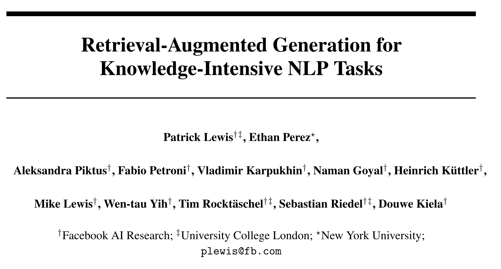

Setting: Given a dataset of text pairs (x, y), like x: question, y: answer.

### Idea

- Model: Receive a sequence $x$, and output a prediction of sequence $\widehat{y}$

LLM contains knowledge somehow, and can be seen to have a parametric memory. Let's extend that by adding a non-parametric external memory, in this case from Wiki. 
So given, for example, a question, model uses its internal knowledge, retrieve external resource, combine them and generate an answer.

More concretely, authors proposed a probabilistic model with 2 ways to do inference approximately: RAG-Sequence Model and RAG-Token Model,
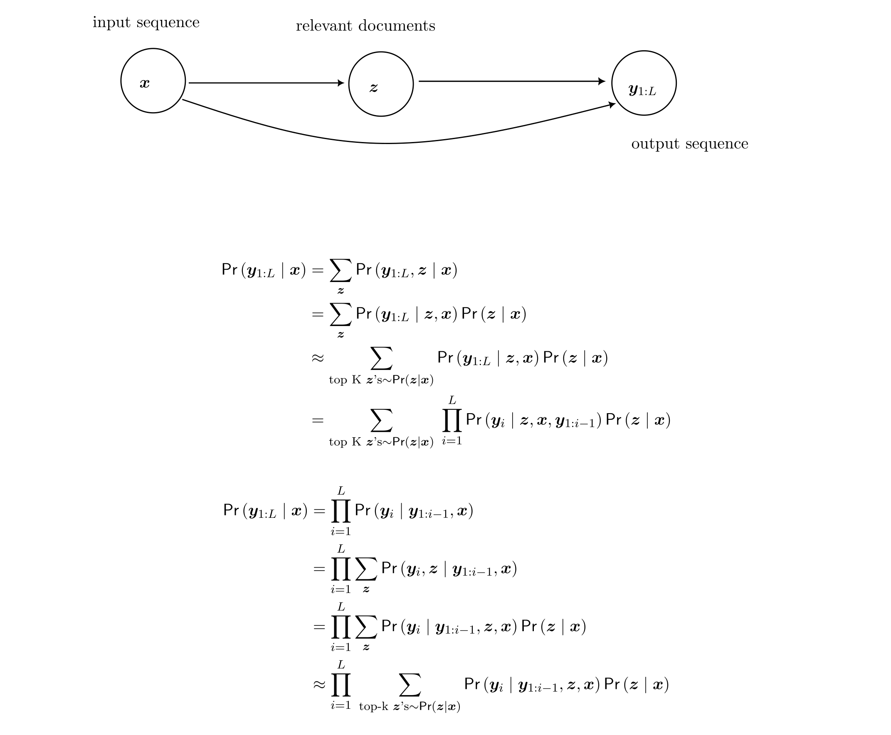

- Dive in to the model architecture:
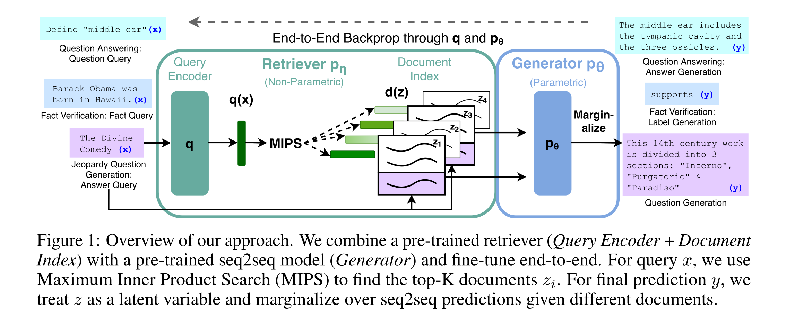
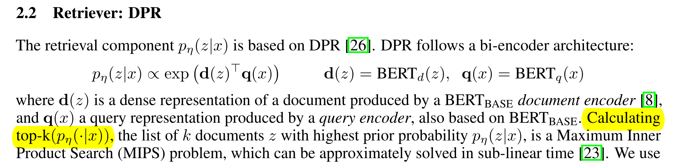

    + The generator: BART-large, 400M parameters. Input is the concatenation of $x$ and top-k latent documents $z$. This BART-large model is accountable for 'parametric memory'.

- Train both Query encoder and Generator.
Training objective is marginal log-likelihood of the target like usual, like in sequence generation.

### Thoughts?

- Knowledge vs overfitting?
- What could be extended? 
    + Offer evidence like in Bing.
    + Instead of using Wiki, get top 5 articles from Google search, input them to the BERT decoder. Or in general, hot-swap memory? Why do they have to replace the whole Wiki instead of substituting relevant articles?

<!-- - LLM seems to not just generate coherent text but it is somehow a good way to encode knowledge. -->

